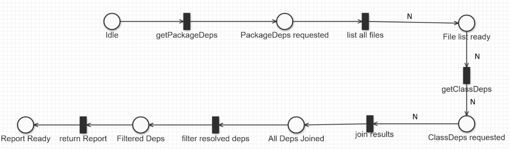

# Assignment #02 - Find the Dependencies

## Problem analysis
The core problem is decomposed into two subproblems:
1. **Class dependency extraction**: parsing a single Java source file to list imported symbol and used types (classes/interfaces).
2. **Package aggregation**: combining class-level reports to get the dependencies at the package (and subsequently project) level.

The parsing of individual Java files is inherently sequential, so our parallelization efforts target the aggregation of multiple class file results.

## Design, strategy and architecture
The overall design reflects what has been said in the previous paragraph and there's some aspect that are common for both the Async version and the Reactive one.
We introduce a central data structure, `DepsReport`, that encapsulates:
- `name`: identifier of the analyzed entity (class or package).
- `dependencies`: set of fully-qualified type names upon which the entity depends.

The library exposes three methods:
- The `getClassDependencies(classSrcFile)` that will return the dependencies of a single file with a `DepsReport`;
- The `getPackageDependencies(packageSrcFolder)` that will call `getClassDependencies` on every class which belongs to that particular package;
- The `getProjectDependencies()` will call `getPackageDependencies(packageSrcFolder)` using the source folder as parameter;

To make it all work the `DependencyAnalyser` will need the project source folder to check internal dependencies;
### Petri Net
Here's a brief Petri Net showing the Behaviour of the program:

### Asynchronous version
This version will chain futures to get the result in an asynchronous fashion, so:
- The `getClassDependencies(classSrcFile)` will return a `Future` of a `DepsReport`;
- The `getPackageDependencies(packageSrcFolder)` result will be a `List<Future<DepsReport>>` so in order to continue chaining callbacks on futures `List<Future<DepsReport>>` to a `Future<List<DepsReport>>` without any blocking operation;
- Then all dependencies are joined together, and dependencies which can be resolved internally are removed from the set;

## Reactive version

This approach models the dependency analysis with the use of a `Flowable`, enabling dynamic updates to the GUI:
- The `getClassDependencies(classSrcFile)` will return a `Flowable` of `DepsReport` and will be responsible only of the parsing of the files handling them in a dedicated thread for computation;
- The `getPackageDependencies(packageSrcFolder)` will simply handle the I/O operations for all the files in the package dynamically and returning the result of `getClassDependencies(classSrcFile)` 

## Technologies and Frameworks
- **Parsing**: JavaParser for AST construction and type resolution.
- **Asynchronous version**: Vert.x futures.
- **Reactive version**: RxJava observables for stream composition.
- **Graph representation**: Graphviz for the dynamic representation of dependencies graph.