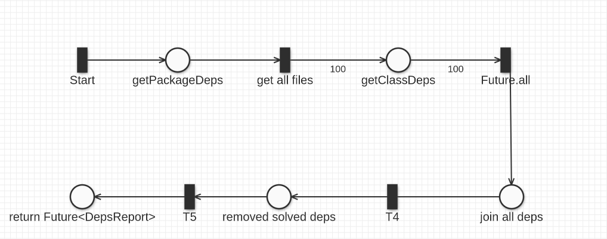

# Assignment #02 - Find the Dependencies

## Problem analysis
The problem can be split into two subproblems:
- produce the dependencies of a single class/file
- produce the dependencies of a package from the dependencies of the contained classes.

Since the parsing of a single java file cannot be parallelized, the generation of the dependencies of a single file will be considered an atomic operation
and our efforts in parallelization will be in producing the dependencies of a package.

## Design, strategy and architecture
The overall design reflects what has been said in the previous paragraph: 
- a record called `DepsReport` has been introduced, and it contains the name of the object (which can be the class name of the package name) and a set of string, which are the names of the classes such object depends on.
- The `getClassDependencies(classSrcFile)` will return a `Future` of a `DepsReport` 
- `getPackageDependencies(packageSrcFolder)` will call `getClassDependencies` on every class which belongs to that particular package. 
- The result will be a `List<Future<DepsReport>>` so in order to continue chaining callbacks on futures `List<Future<DepsReport>>` to a `Future<List<DepsReport>>` without any blocking operation
- Then all dependencies are joined together, and dependencies which can be resolved internally are removed from the set.

### Petri net
